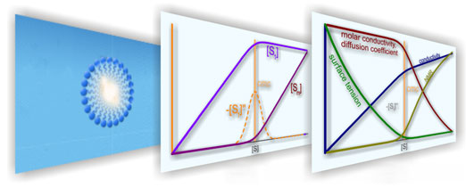

# APN

   

"APN" Critical Aggregation Concentration Model

A concentration model for the systematic dermination of the critical aggregation concentration from experimental data of solution properties.

Further details: 

http://www.usc.es/fotofqm/en/units/single-molecule-fluorescence/concentration-model-surfactants-near-cmc

A Model for Monomer and Micellar Concentrations in Surfactant Solutions. Application to Conductivity, NMR, Diffusion and Surface Tension data
Wajih Al-Soufi, Lucas Piñeiro, Mercedes Novo, Journal of Colloid and Interface Science 2012, 370, 102–110 https://doi.org/10.1016/j.jcis.2011.12.037

Dye exchange in micellar solutions. Quantitative analysis of bulk and single molecule fluorescence titrations
Lucas Piñeiro, Sonia Freire, Jorge Bordello, Mercedes Novo, and Wajih Al-Soufi, Soft Matter 2013, 9, 10779-10790, https://doi.org/10.1039/c3sm52092g

Fluorescence Emission of Pyrene in Surfactant Solutions
Lucas Piñeiro, Mercedes Novo, and Wajih Al-Soufi, Advances in Colloid and Interface Science 2015, 215, 1–12. https://doi.org/10.1016/j.cis.2014.10.010

A Surfactant Concentration Model for the Systematic Determination of the Critical Micellar Concentration and the Transition Width (Review)
Wajih Al-Soufi and Mercedes Novo, Molecules 2021, 26, no. 17: 5339. https://doi.org/10.3390/molecules26175339

